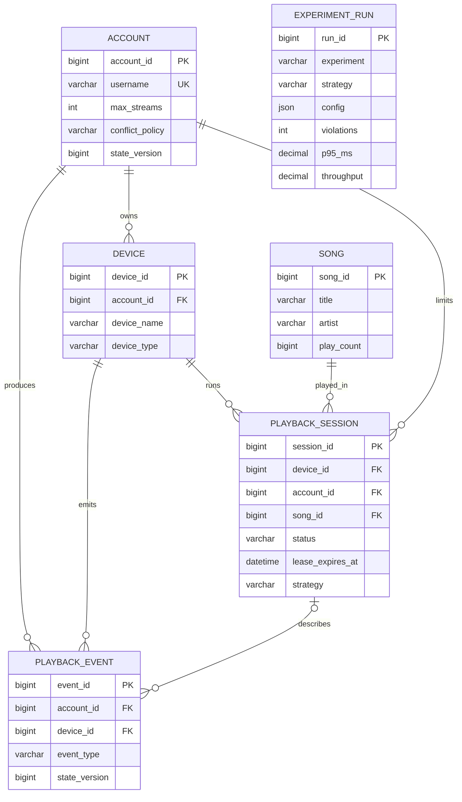
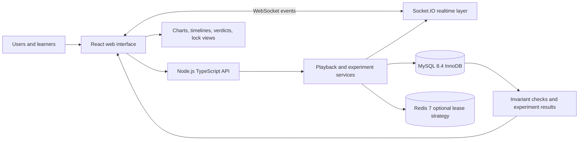
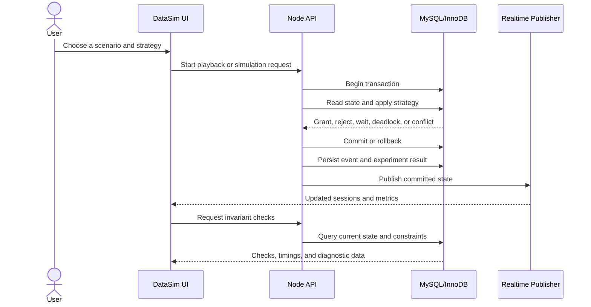

# DataSim: Project Proposal and Database Design Document

**Course:** Database Management Systems  
**Date:** 26 September 2026  
**Repository:** [github.com/albertaj23/DataSim](https://github.com/albertaj23/DataSim)

## Contributors

| Reg. No. | Name |
|---|---|
| 24BCE0043 | Akshat Raj |
| 24BCE2877 | Vishal Vivek |
| 24BCE2878 | Mohit Kumar |

---

## 1. Project Title

**DataSim: A Friendly Simulation Lab for Relational Database Systems**

**Music scenario:** Coordinating shared listener accounts and concurrent playback across multiple devices.

## 2. Introduction and Background

Database systems support applications where many users and devices read and modify shared data at the same time. A database may appear correct during a single-user demonstration but behave incorrectly when concurrent requests arrive together. Examples include lost updates, inconsistent reads, race conditions, lock waits, deadlocks, and constraint violations.

DataSim is an interactive database simulation lab that makes these behaviors visible. It provides friendly user interfaces for running repeatable scenarios and technical views for examining the underlying transactions, locks, constraints, isolation levels, and results. Music playback is used as an understandable example: one listener account may be active on several devices, but a stream limit must remain correct even when many devices press Play simultaneously.

The music domain is an example rather than a limitation. The same simulation approach can be extended to reservations, inventory, ticketing, banking, collaborative editing, or other systems with shared state and concurrent users.

## 3. Problem Statement

In a multi-device music service, several devices belonging to one listener account may attempt to start playback at nearly the same time. Each request can read the same database state before writing a new playback session. If the operations are not coordinated correctly, more sessions may become active than the account's permitted limit.

The project addresses the following problem:

> How can a relational DBMS maintain a correct, real-time shared state under concurrent operations, and what correctness and performance trade-offs are introduced by different transaction, isolation, locking, and constraint strategies?

DataSim also demonstrates the related lost-update problem. When many listeners finish the same song concurrently, independent read-modify-write operations may overwrite one another and produce an incorrect play count.

## 4. Objectives

The objectives of DataSim are to:

1. Model users, devices, songs, playback sessions, events, and experiment results in a normalized relational database.
2. Demonstrate concurrency anomalies using reproducible scenarios rather than only theoretical examples.
3. Compare alternative strategies, including naive operations, transactions, serializable isolation, pessimistic locking, optimistic version checks, unique constraints, triggers, and a Redis lease strategy.
4. Show how isolation levels affect visibility, blocking, deadlocks, and correctness.
5. Visualize transaction schedules, lock information, wait-for relationships, rollbacks, and invariant checks.
6. Simulate a scalable crowd of virtual music listeners using real database transactions.
7. Provide a friendly interface for learners and a technical interface for detailed inspection.
8. Persist experiment configurations and results so that runs can be compared and analyzed.
9. Keep the platform extensible so that future scenarios can reuse the same simulation and measurement patterns.

## 5. Scope of the Project

### Included

- MySQL 8.4 relational database using the InnoDB storage engine.
- Database schema for accounts, devices, songs, playback sessions, playback events, and experiment runs.
- Account-level playback limits and lease-based session expiry.
- Multiple concurrency-control strategies for the same business operation.
- Lost-update experiments using a shared song play counter.
- Transaction Stepper for statement-by-statement execution of two transactions.
- Concurrency Lab for repeated race experiments and measurement.
- Simulation Control Room for virtual listeners and real database traffic.
- InnoDB lock and wait-for information where available.
- Checks for stream-limit violations, expired leases, duplicate sessions, audit consistency, and related invariants.
- React web interface, Node.js/TypeScript API, Docker-based local setup, and automated tests.
- Documentation of ER design, normalization, concurrency behavior, experiments, and results.

### Excluded

- Real audio streaming, media storage, or content licensing.
- Production authentication, authorization, subscriptions, or payment processing.
- A production-scale cloud deployment or guaranteed multi-region availability.
- Personalization, recommendations, advertising, and social networking features.
- Claim that the implementation represents the internal design of a commercial streaming service.
- Unlimited arbitrary workloads; the simulator uses bounded, controlled scenarios for repeatability.

## 6. Requirement Analysis

### 6.1 Users of the system

| User | Main needs |
|---|---|
| Student or learner | Understand DBMS concepts through guided visual scenarios. |
| Demonstrator or instructor | Run repeatable experiments and explain anomalies during a presentation. |
| Technical user | Inspect SQL effects, locks, transactions, constraints, and measured results. |
| Developer | Add new database strategies or scenarios without replacing the platform. |

### 6.2 Data to be stored

- **Account:** username, stream limit, conflict policy, state version, and laboratory flag.
- **Device:** account ownership, device name/type, and last-seen time.
- **Song:** title, artist, and play counter used by the lost-update experiment.
- **Playback session:** device, account, song, status, position, timestamps, lease, and strategy.
- **Playback event:** state transition, account/device/session references, timestamp, version, request id, and details.
- **Experiment run:** experiment type, strategy, configuration, trial, outcomes, latency, throughput, violations, and batch id.

### 6.3 Required operations

1. Look up an account and its devices.
2. Start playback on a device.
3. Pause, resume, release, or stop playback.
4. Renew a playback lease through a heartbeat.
5. Take over playback from another device according to a conflict policy.
6. Reject stale or fenced device requests.
7. Switch the active concurrency strategy.
8. Run stream-limit and lost-update experiments.
9. Step through two transactions one statement at a time.
10. Start, pause, resume, repair, and stop a crowd simulation.
11. Inspect live state, audit events, lock information, and experiment history.
12. Check whether database invariants still hold.

### 6.4 Information to retrieve and analyze

- Number of active sessions per account.
- Whether the stream-limit invariant passed or failed.
- Lost updates and final counter values.
- Transaction outcomes, retries, deadlocks, rollbacks, and timeouts.
- Lock holders, waiting transactions, and wait-for relationships.
- Latency percentiles, throughput, violation count, and success rate.
- Timeline of events during a simulated run.
- Comparison of correctness and performance across strategies.

### 6.5 Functional requirements

- **FR-01:** The system shall store account, device, song, session, event, and experiment data.
- **FR-02:** The system shall support concurrent playback claims from multiple devices.
- **FR-03:** The system shall implement and compare multiple protection strategies.
- **FR-04:** The system shall record experiment configuration and results.
- **FR-05:** The system shall expose invariant and consistency checks.
- **FR-06:** The system shall provide friendly scenario controls and technical inspection views.
- **FR-07:** The system shall reject expired, preempted, or stale device operations.

### 6.6 Non-functional requirements

- **Correctness:** Protected strategies must enforce the defined invariants.
- **Repeatability:** Experiments must use controlled inputs and persist their results.
- **Observability:** Important database behavior must be visible through events, metrics, and technical views.
- **Scalability:** The simulator must support a bounded crowd of virtual users and devices.
- **Maintainability:** Database access uses typed, parameterized SQL and clear service boundaries.
- **Portability:** The local system must run with Node.js, npm, Docker, MySQL, and Redis.
- **Usability:** A learner should be able to run the main scenarios without manually writing SQL.

## 7. Database Selection and Justification

### Selected technology

- **Database:** MySQL 8.4
- **Database type:** Relational database management system
- **Storage engine:** InnoDB
- **Additional component:** Redis 7 is used only for an optional lease-based comparison strategy.
- **Application stack:** Node.js, TypeScript, Express, React, and Socket.IO.

### Justification

A relational DBMS is appropriate because DataSim studies transactions, isolation levels, row and gap locks, constraints, foreign keys, deadlocks, and consistency of related entities. MySQL/InnoDB provides these mechanisms in a real database engine, allowing the project to measure actual behavior rather than simulate every rule in application code.

MySQL was selected because:

1. InnoDB supports ACID transactions and multiple isolation levels.
2. It provides row-level and next-key locking needed for concurrency experiments.
3. It supports foreign keys, unique constraints, checks, triggers, and generated columns.
4. Its performance schema exposes lock and transaction information for inspection.
5. It is freely available and runs consistently through Docker.
6. It is widely used and gives the project practical SQL and DBMS experience.

Redis is included as a deliberately separate comparison point. Its lease strategy demonstrates how an external key-value gate can coordinate access, while MySQL remains the source of durable relational state.

## 8. Data Model / Database Design

### 8.1 Main entities and attributes

| Entity | Important attributes | Key or constraint |
|---|---|---|
| `account` | `account_id`, `username`, `max_streams`, `conflict_policy`, `state_version`, `is_lab` | Primary key; unique username; checks on limit and policy. |
| `device` | `device_id`, `account_id`, `device_name`, `device_type`, `last_seen_at` | Primary key; foreign key to account; unique account/name. |
| `song` | `song_id`, `title`, `artist`, `play_count` | Primary key; non-negative play count. |
| `playback_session` | `session_id`, `device_id`, `account_id`, `song_id`, `status`, `position_ms`, `lease_expires_at`, `strategy` | Primary key; composite device/account foreign key; foreign key to song; status checks and indexes. |
| `playback_event` | `event_id`, `account_id`, `device_id`, `session_id`, `event_type`, `state_version`, `client_request_id`, `detail` | Primary key; unique device/request id for idempotency. |
| `experiment_run` | `run_id`, `experiment`, `strategy`, `config`, `outcomes`, `violations`, `latency`, `throughput`, `batch_id` | Primary key; indexes for batch and experiment history. |

### 8.2 Relationships



### 8.3 Relational schema

```text
ACCOUNT(account_id PK, username UNIQUE, max_streams, conflict_policy,
        state_version, is_lab)

DEVICE(device_id PK, account_id FK -> ACCOUNT, device_name,
       device_type, last_seen_at, UNIQUE(account_id, device_name))

SONG(song_id PK, title, artist, play_count)

PLAYBACK_SESSION(session_id PK, device_id, account_id, song_id FK -> SONG,
                 status, position_ms, started_at, lease_expires_at,
                 ended_at, strategy,
                 FK(device_id, account_id) -> DEVICE(device_id, account_id))

PLAYBACK_EVENT(event_id PK, account_id, device_id, session_id, event_type,
               state_version, client_request_id, created_at, detail,
               UNIQUE(device_id, client_request_id))

EXPERIMENT_RUN(run_id PK, experiment, strategy, config, outcomes,
               violations, p50_ms, p95_ms, throughput, batch_id, created_at)
```

### 8.4 Keys and constraints

- Primary keys identify every account, device, song, session, event, and run.
- Foreign keys preserve ownership and reference integrity between accounts, devices, songs, and sessions.
- A composite foreign key ensures that a session's device belongs to the same account recorded on the session.
- Unique username and account/device-name constraints prevent duplicate identities.
- A unique device/request-id constraint makes state-changing requests idempotent.
- Status, policy, stream-limit, position, and counter checks reject invalid values.
- An optional generated-column unique index demonstrates declarative protection for one active session per account.
- The main rule is a predicate over multiple rows, so it requires transaction and concurrency control rather than only a primary key.

**Core invariant:**

> For every account, the number of `PLAYING` sessions with an unexpired lease must be less than or equal to `max_streams`.

### 8.5 Normalization

The core schema follows third normal form for its durable entities:

1. Each table represents one main entity or event type.
2. Attributes are atomic and do not contain repeating groups.
3. Non-key attributes depend on the whole key.
4. Device details are stored once in `device`, rather than repeated for every session.
5. Song details are stored once in `song`, rather than repeated in playback rows.
6. Event and experiment history are separated from current state.

`playback_session` intentionally stores both `device_id` and `account_id` because account-level queries and locking are central to the workload. The composite foreign key keeps this controlled denormalization consistent while avoiding an extra join in critical concurrency paths.

## 9. System Architecture / Workflow Diagram

### 9.1 High-level architecture



### 9.2 Scenario workflow



### 9.3 Output of the system

The system produces:

- Friendly playback and simulation views.
- Live listener/device state.
- Strategy verdicts and invariant status.
- Transaction schedules and step-by-step outcomes.
- Lock tables and wait-for information when available.
- Experiment history, latency, throughput, retries, and violations.
- CSV and Markdown experiment results for analysis.

## Conclusion

DataSim combines a practical relational schema with an interactive laboratory for studying database behavior under concurrency. The music playback example makes shared state easy to understand, while the underlying design focuses on general DBMS concepts that apply to many domains. By connecting a friendly UI to real MySQL transactions and measurable outcomes, the project helps users see how database design choices affect correctness, performance, and scalability.
